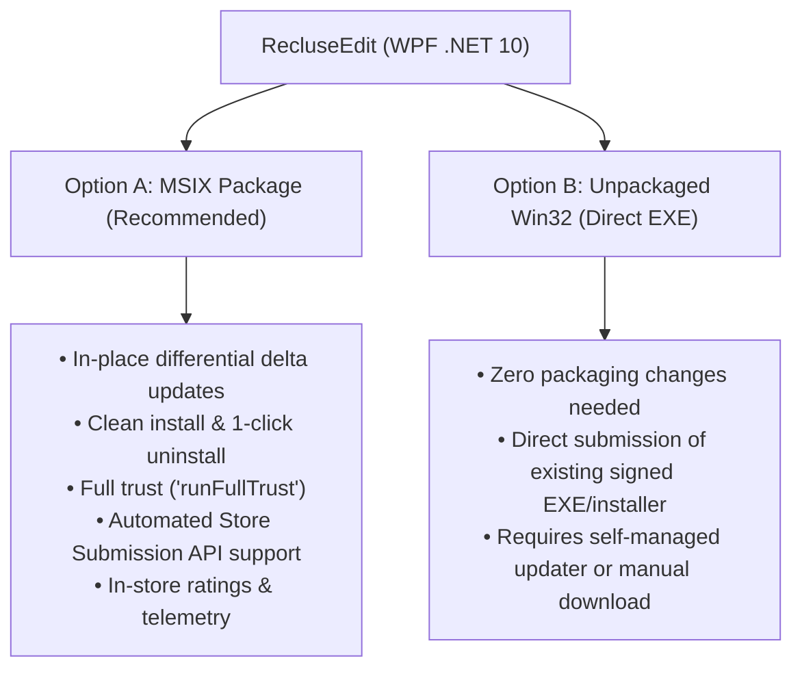
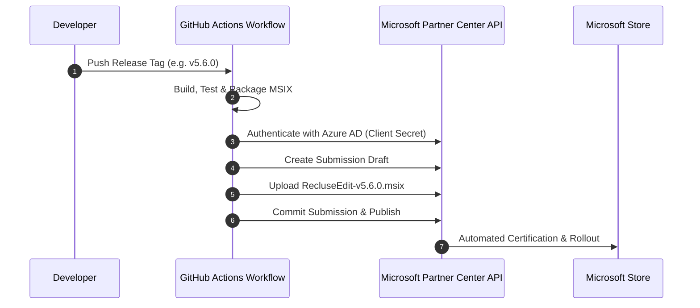

# 🏪 Microsoft Store Publishing Guide: RecluseEdit

This guide provides a comprehensive, step-by-step walkthrough for publishing **RecluseEdit** to the **Microsoft Store** as an independent developer under the publisher organization **`indoctrinatedrecluse`**, exploring zero-cost developer registration options, comparing packaging models, and establishing automated CI/CD release submissions directly from GitHub Actions.

---

## 📋 Table of Contents

1. [Developer Account & Cost Analysis (How to Publish for Free)](#1-developer-account--cost-analysis-how-to-publish-for-free)
2. [Packaging Models: MSIX vs. Unpackaged Win32](#2-packaging-models-msix-vs-unpackaged-win32)
3. [Step-by-Step Publishing Walkthrough](#3-step-by-step-publishing-walkthrough)
   - [Step 1: Partner Center Registration](#step-1-partner-center-registration)
   - [Step 2: Reserve the Application Name](#step-2-reserve-the-application-name)
   - [Step 3: Prepare Application Packaging (MSIX)](#step-3-prepare-application-packaging-msix)
   - [Step 4: Store Visual Assets & Metadata Checklist](#step-4-store-visual-assets--metadata-checklist)
   - [Step 5: First-Time Manual Submission & Certification](#step-5-first-time-manual-submission--certification)
4. [Automating Store Releases via GitHub Actions](#4-automating-store-releases-via-github-actions)
   - [Prerequisites for Automation](#prerequisites-for-automation)
   - [Workflow Integration (`.github/workflows/release.yml`)](#workflow-integration-githubworkflowsreleaseyml)
5. [Summary & Recommendations](#5-summary--recommendations)

---

## 1. Developer Account & Cost Analysis (How to Publish for Free)

Publishing to the Microsoft Store requires a **Microsoft Partner Center** account registered under the **Windows & Xbox** developer program.

### Cost Breakdown
| Account Type | Cost | Recurring Fee? | Notes |
| :--- | :--- | :--- | :--- |
| **Individual Account** | **~$19 USD** (one-time) | **None** ($0/yr) | Permanent lifetime publishing rights for an individual developer. No annual subscription (unlike Apple's $99/year). |
| **Company Account** | **~$99 USD** (one-time) | **None** ($0/yr) | Requires legal entity verification (DUNS number). |

> [!NOTE]
> **Microsoft Store Revenue Share**: For free apps and apps using their own commerce systems, Microsoft charges **0% revenue share** (the developer keeps 100%).

### 🆓 How to Get the Account for Free
As an independent developer, you can obtain a free registration waiver through several official programs:

1. **GitHub Student Developer Pack**:
   - If you are a student or eligible academic, the GitHub Student Developer Pack provides an **Azure for Students** credit and a Microsoft Store registration promo code that waives the $19 account fee entirely.
2. **Microsoft for Startups Founders Hub**:
   - If you develop open-source developer tooling or software, you can apply for the free **Founders Hub** program (open to any developer with an idea, no venture capital required). It includes Azure credits, developer tooling subscriptions, and waived Partner Center publishing fees.
3. **Microsoft Learn Student Ambassadors / MVP Program**:
   - Members receive free Partner Center developer registration vouchers.
4. **Direct Registration**:
   - If promo waivers are unavailable, the standard **$19 USD one-time fee** remains one of the most affordable app store developer registrations across the industry (lifetime access).

---

## 2. Packaging Models: MSIX vs. Unpackaged Win32

Microsoft Store accepts two deployment models for modern WPF .NET desktop applications:



### Recommendation: **Option A (MSIX Packaging)**
For modern Store publishing and automated GitHub Actions releases, **MSIX** is strongly recommended:
- **Clean OS Integration**: Uses Windows Application Management; no leftover registry entries or files on uninstall.
- **Background Auto-Updates**: The Microsoft Store automatically downloads lightweight delta updates in the background when you publish a new version.
- **Full Trust Capability**: Adding `<rescap:Capability Name="runFullTrust" />` gives RecluseEdit full desktop permissions to spawn compilers, formatters, terminal shells, and access the filesystem seamlessly.

---

## 3. Step-by-Step Publishing Walkthrough

### Step 1: Partner Center Registration
1. Navigate to the [Microsoft Partner Center](https://partner.microsoft.com/dashboard/registration).
2. Sign in with your primary Microsoft account.
3. Select **Developer programs** -> **Windows & Xbox**.
4. Choose **Individual Account**.
5. Set your **Publisher Display Name** to `indoctrinatedrecluse`.
6. Complete payment (or apply your promotional voucher).

---

### Step 2: Reserve the Application Name
1. In the Partner Center dashboard, click **Create a new app**.
2. Enter the reserved app name: **`RecluseEdit`** (or `RecluseEdit Code Editor`).
3. Click **Reserve product name**.
4. Once reserved, navigate to **Product management** -> **Product Identity**. Note the following parameters (needed for the manifest):
   - **Package/Identity/Name** (e.g. `indoctrinatedrecluse.RecluseEdit`)
   - **Package/Identity/Publisher** (e.g. `CN=A1B2C3D4-5678-...`)
   - **Package/Properties/PublisherDisplayName** (`indoctrinatedrecluse`)

---

### Step 3: Prepare Application Packaging (MSIX)

You can package RecluseEdit as an MSIX package using either the .NET SDK (`dotnet publish`) or a Windows Application Packaging Project (`.wapproj`):

#### Approach 1: `dotnet msix` CLI (Simplest & CI-Friendly)
Install the .NET MSIX packaging global tool:
```powershell
dotnet tool install --global dotnet-msix
```
Create an `AppxManifest.xml`:
```xml
<?xml version="1.0" encoding="utf-8"?>
<Package
  xmlns="http://schemas.microsoft.com/appx/manifest/foundation/windows10"
  xmlns:uap="http://schemas.microsoft.com/appx/manifest/uap/windows10"
  xmlns:rescap="http://schemas.microsoft.com/appx/manifest/foundation/windows10/restrictedcapabilities">

  <Identity
    Name="indoctrinatedrecluse.RecluseEdit"
    Publisher="CN=YOUR_PARTNER_CENTER_PUBLISHER_ID"
    Version="5.5.0.0"
    ProcessorArchitecture="x64" />

  <Properties>
    <DisplayName>RecluseEdit</DisplayName>
    <PublisherDisplayName>indoctrinatedrecluse</PublisherDisplayName>
    <Logo>Assets\StoreLogo.png</Logo>
    <Description>A fast, modern code editor and web IDE featuring deep AI integration, extensible language packs, and compiler auto-discovery.</Description>
  </Properties>

  <Dependencies>
    <TargetDeviceFamily Name="Windows.Desktop" MinVersion="10.0.19041.0" MaxVersionTested="10.0.26100.0" />
  </Dependencies>

  <Capabilities>
    <rescap:Capability Name="runFullTrust" />
  </Capabilities>

  <Applications>
    <Application Id="App" Executable="RecluseEdit.exe" EntryPoint="Windows.FullTrustApplication">
      <uap:VisualElements
        DisplayName="RecluseEdit"
        Description="RecluseEdit Code Editor"
        BackgroundColor="transparent"
        Square150x150Logo="Assets\Square150x150Logo.png"
        Square44x44Logo="Assets\Square44x44Logo.png">
        <uap:DefaultTile Wide310x150Logo="Assets\Wide310x150Logo.png" />
      </uap:VisualElements>
    </Application>
  </Applications>
</Package>
```

---

### Step 4: Store Visual Assets & Metadata Checklist

Prepare the following branding assets derived from `Assets/app.png` in transparent PNG format:

| Asset | Size | Purpose |
| :--- | :--- | :--- |
| **Small Tile** | `44 × 44 px` | Taskbar, app list, search results |
| **Medium Tile** | `150 × 150 px` | Start Menu tile |
| **Wide Tile** | `310 × 150 px` | Wide Start Menu tile |
| **Store Logo** | `300 × 300 px` | Microsoft Store listing logo |
| **Splash Screen** | `620 × 300 px` | App startup splash image |
| **Screenshots** | `1920 × 1080 px` | Min 1, recommended 4 (Editor, AI Chat, Themes, SDK diagnostics) |

#### Store Metadata:
- **Title**: RecluseEdit
- **Category**: Developer tools / Utilities
- **Price**: Free
- **Privacy Policy URL**: Link to project README or dedicated privacy policy page on GitHub.
- **Support Contact**: GitHub Issues URL (`https://github.com/indoctrinatedrecluse/RecluseEdit/issues`).
- **Age Rating (IARC)**: Fill out the free 3-minute IARC questionnaire in Partner Center (general developer tool rating: All Ages).

---

### Step 5: First-Time Manual Submission & Certification
> [!IMPORTANT]
> The **very first submission (v1)** of an application must be submitted **manually** through the Partner Center dashboard. Microsoft requires you to establish the initial description, age rating questionnaire, pricing, and category. Once the initial submission is certified and published, all subsequent version updates can be **100% automated via CI/CD**!

1. Upload the generated `.msix` or `.msixupload` package.
2. Complete the IARC questionnaire and listing text.
3. Click **Submit to the Store**.
4. Certification typically completes within **24–48 hours**.

---

## 4. Automating Store Releases via GitHub Actions

Once RecluseEdit is published on the Store, publishing future version updates can be completely automated through the **Microsoft Store Submission API**.



### Prerequisites for Automation

1. **Link Azure Active Directory (Entra ID)**:
   - In Partner Center, go to **Settings** (gear icon) -> **Account settings** -> **Users** -> **Azure AD applications**.
   - Click **Create Azure AD application** (e.g. `RecluseEdit-CI-Publisher`).
   - Assign the **Manager** role to this app.
2. **Generate API Secret**:
   - Under the newly created Azure AD app, create a **Key** (Client Secret).
   - Copy the **Tenant ID**, **Client ID**, and **Client Secret**.
3. **Configure GitHub Secrets**:
   In your GitHub repository (`Settings -> Secrets and variables -> Actions`), add:
   - `MS_STORE_TENANT_ID`
   - `MS_STORE_CLIENT_ID`
   - `MS_STORE_CLIENT_SECRET`
   - `MS_STORE_APP_ID` (from Partner Center Product Identity)

---

### Workflow Integration (`.github/workflows/release.yml`)

You can use the official Microsoft Store GitHub Action or a direct REST script:

```yaml
      # Step: Submit package to Microsoft Store
      - name: Publish to Microsoft Store
        if: startsWith(github.ref, 'refs/tags/v')
        uses: microsoft/store-action@v1
        with:
          tenant-id: ${{ secrets.MS_STORE_TENANT_ID }}
          client-id: ${{ secrets.MS_STORE_CLIENT_ID }}
          client-secret: ${{ secrets.MS_STORE_CLIENT_SECRET }}
          app-id: ${{ secrets.MS_STORE_APP_ID }}
          package-path: package/RecluseEdit-v${{ env.RELEASE_TAG }}.msix
          skip-certification: false
```

---

## 5. Summary & Recommendations

| Item | Status / Plan |
| :--- | :--- |
| **Publishing Cost** | **Free** (via GitHub Student Developer Pack or Founders Hub waiver), or a **one-time $19 USD** individual fee for lifetime access. |
| **Packaging Choice** | **MSIX** with `<rescap:Capability Name="runFullTrust" />` for seamless in-store differential auto-updates and sandbox compliance. |
| **Code Signing** | Microsoft Store automatically signs packages with Microsoft's trusted root during Store ingestion, eliminating all SmartScreen warnings for Store users. |
| **CI/CD Automation** | **100% Automatable** via `microsoft/store-action` and Microsoft Store Submission API once the initial v1 submission is manually certified. |

